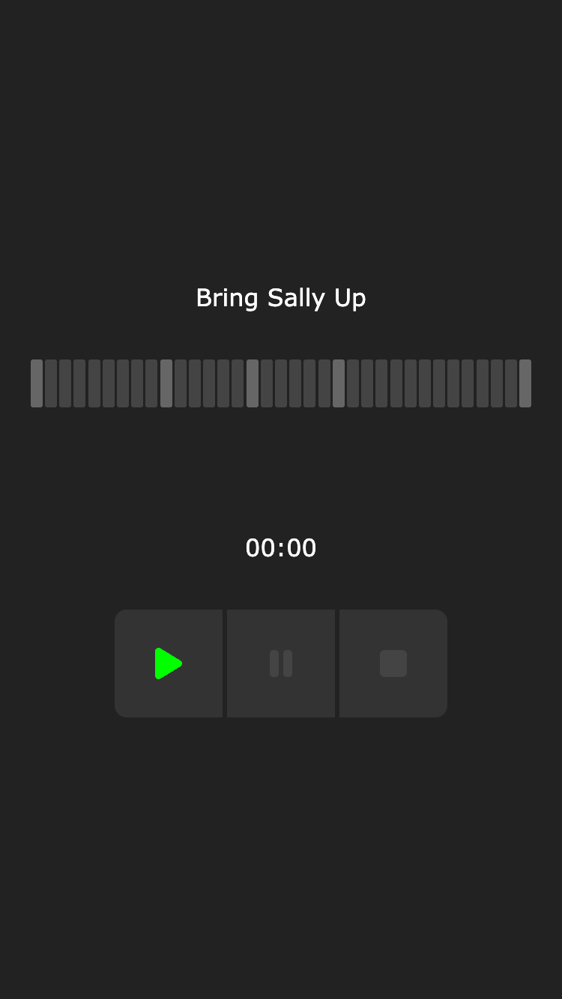

# Sally

## About

The "Bring Sally Up" exercise challenge is 30 reps of anything over 3:30 minutes (about 6 seconds per rep, with 4 long holds).

The song is "Flower" from the album Play (1999) by Moby. "Bring Sally Up" is actually a misheard lyric.

> Green Sally up, Green Sally down
>
> Last done squat gotta tear the ground
>
> Old Miss Lucy's dead and gone
>
> Left me here to weep and moan

## Screenshot

